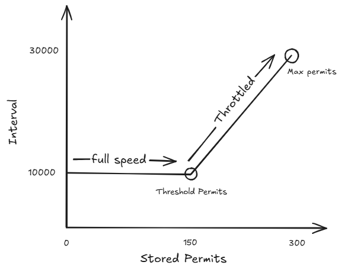
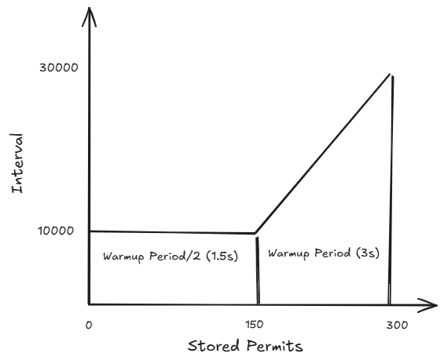
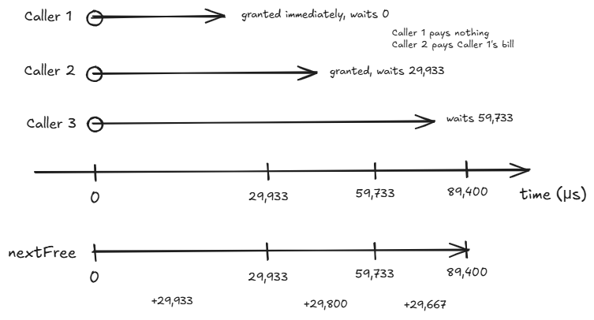
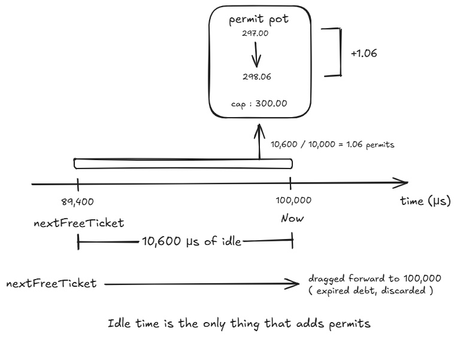
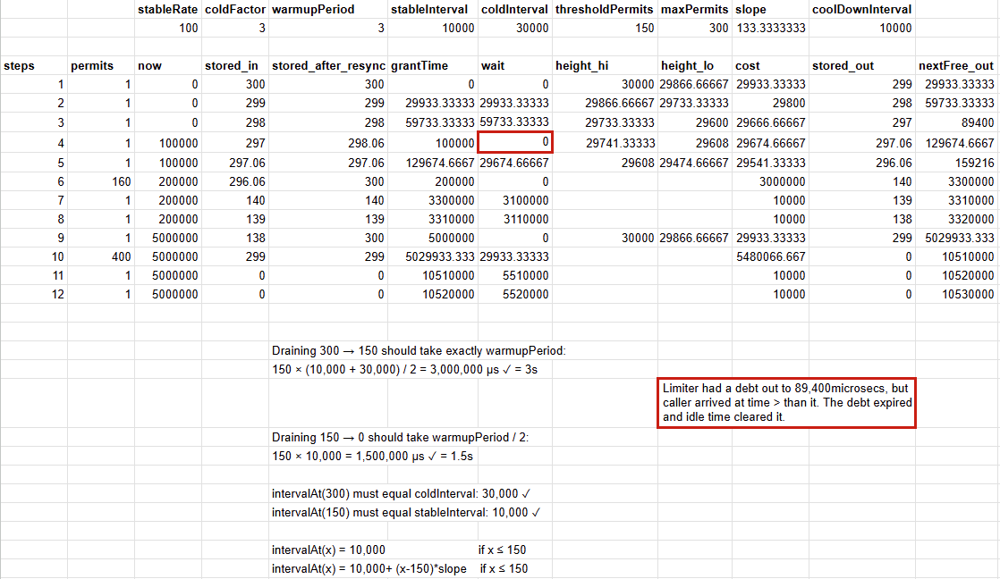
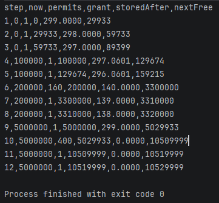

# Algorithmic Verification

How the warm-up algorithm was verified against Guava's reference implementation, and what each file here is for.

---

## Why

If you write an implementation, run it, and turn its output into test expectations, the tests prove nothing — any misreading of the algorithm gets baked in as correct. Misread `thresholdPermits = 0.5 × warmupPeriod / stableInterval` by dropping the `0.5`, and every derived value shifts while the suite stays green.

The fix is an **oracle**: expected values from a source that isn't your code. This folder is that oracle and the record of how it was built.

Three independent sources, each catching a different class of error:

1. **Hand derivation** from the published equations — catches misunderstanding
2. **Self-consistency** against the geometry the constants came from — catches arithmetic slips
3. **Guava**, run on a fake clock — catches everything the equations don't capture

---

## Configuration

Chosen for round numbers, so errors are visible by inspection. All times in **microseconds**.

```
stableRate = 100/s     coldFactor = 3     warmupPeriod = 3,000,000

stableInterval   = 10,000        coldInterval     = 30,000
thresholdPermits = 150           maxPermits       = 300
slope            = 133.333…      coolDownInterval = 10,000
```

Acquisition cost depends on how full the permit pot is:

```
intervalAt(x) = 10,000                          if x ≤ 150
              = 10,000 + (x − 150) × 133.333…   if x > 150
```



A permit from a nearly-full pot (idle, cold) costs up to 30,000 µs; at or below the threshold (busy, warm) it costs 10,000 µs — full rate.

## Self-consistency checks

The constants were derived *from* these properties, so they must hold. A wrong constant breaks at least one.



```
drain 300 → 150:  150 × (10,000 + 30,000)/2 = 3,000,000 = warmupPeriod      ✓
drain 150 → 0:    150 × 10,000              = 1,500,000 = warmupPeriod/2    ✓
intervalAt(300) = 30,000 = coldInterval     intervalAt(150) = 10,000        ✓
```

---

## The state machine

Two mutable values: **`storedPermits`** (fractional, bounded to `[0, maxPermits]`) and **`nextFreeTicket`** (a point in time).

Each acquisition applies four rules in order:

1. **Resync** — if the clock overtook `nextFreeTicket`, convert the gap into permits at `coolDownInterval` each, cap at `maxPermits`, set `nextFreeTicket = now`
2. **Grant** — caller is granted at the *current* `nextFreeTicket`
3. **Cost** — area under the interval curve for permits taken, plus `stableInterval` for any created fresh
4. **Update** — advance `nextFreeTicket` by the cost, subtract permits spent

**Debt model:** the grant happens *before* the advance, so the first caller after an idle period waits nothing and its cost lands on the next caller.



**Resync is the only source of permits.** Acquisitions can only reduce the pot.



---

## The trace

Twelve steps chosen to exercise every branch — cold start, resync firing and not firing, threshold crossing, idle beyond the warm-up period, `n > maxPermits`, and an empty pot. Built in a spreadsheet with formulas, so changing a parameter recomputes the table.



Results that confirm the invariants, none of them aimed at:

- **Step 6** — draining the sloped region cost exactly **3,000,000 µs**, the warm-up period. The geometry check appearing spontaneously inside an acquisition.
- **Steps 7 and 11** — cost exactly **10,000.00 µs**, confirming the curve is flat below the threshold.
- **Step 9** — 5s idle against a 3s warm-up resynced to exactly **300.00** and capped.
- **Steps 1–3** — implied rate ≈ 33/s, which is `stableRate / coldFactor`.
- `nextFreeTicket` non-decreasing throughout.

To cross-verify or check with different values, download `warmup-trace.xlsx` 
---

## Guava reference check

**Complete.** The vectors agree with Google Guava's reference implementation to within its integer-truncation bound. No algorithmic disagreement was found.

Layers 1–3 all derive from the same reading of the same equations — if that reading is wrong they agree and are wrong together. Only an independent implementation breaks that shared failure mode.

A throwaway Java harness drives Guava's `RateLimiter.SmoothWarmingUp` through the same twelve-step script. It can't run on the real clock — Guava would genuinely sleep, and jitter makes results non-reproducible — so its package-private `SleepingStopwatch` is replaced with a fake that advances only on command, the same technique as this package's `ManualClock`. The harness declares itself part of `com.google.common.util.concurrent` to reach it; Guava's own `RateLimiterTest` is the reference for the pattern.

Three details that cost time to find: the limiter is built with the package-private `RateLimiter.create(rate, warmupPeriod, unit, coldFactor, stopwatch)` and cast to `SmoothRateLimiter`, since the state lives on that subclass; `acquire()` is avoided because it sleeps and returns seconds slept, so `reserveEarliestAvailable(permits, nowMicros)` is called directly for the grant time; and `storedPermits` is package-private and readable, but `nextFreeTicketMicros` is **private** and must be read via the accessor `queryEarliestAvailable(0)`. Raw output is preserved as `guava-output.csv`.



### Result
Divergence, exact vectors minus Guava, in microseconds:

| step | grant Δ | storedAfter Δ | nextFree Δ |
|---|---|---|---|
| 1 | 0.0000 | 0.0000 | 0.3333 |
| 2 | 0.3333 | 0.0000 | 0.3333 |
| 3 | 0.3333 | 0.0000 | 1.0000 |
| 4 | 0.0000 | −0.0001 | 0.6667 |
| 5 | 0.6667 | −0.0001 | 1.0000 |
| 6 | **0.0000** | **0.0000** | **0.0000** |
| 7 | **0.0000** | **0.0000** | **0.0000** |
| 8 | **0.0000** | **0.0000** | **0.0000** |
| 9 | 0.0000 | 0.0000 | 0.3333 |
| 10 | 0.3333 | 0.0000 | 1.0000 |
| 11 | 1.0000 | 0.0000 | 1.0000 |
| 12 | 1.0000 | 0.0000 | 1.0000 |

**Maximum divergence: 1.0000 µs**, entirely accounted for by truncation.
 
**Steps 6–8 match exactly, and that is the control.** Their costs are whole microseconds — 3,100,000 and 10,000 — so there is nothing to floor. Where truncation cannot occur the implementations are identical, confirming the divergence elsewhere is rounding rather than logic.

### Truncation feeds back into state
 
Guava computes in `long` microseconds and floors the wait at two points inside `storedPermitsToWaitTime`. The notable part is that the rounding does not stay in the time domain.
 
At step 3 Guava floored `nextFreeTicket` to 89,399 rather than 89,400. At step 4 resync therefore measured the idle gap as `100,000 − 89,399 = 10,601 µs`, buying `1.0601` permits instead of `1.0600` — hence `storedAfter` of 297.0601 against an exact 297.0600. A rounding artifact in one step becomes different *state* in the next.
 
Bounded impact: Guava's timeline runs up to 1 µs behind exact per acquisition, granting marginally early. Against a 10,000 µs stable interval that is a systematic rate error under **0.01%**, always permissive.

### Decision
 
**This implementation uses exact arithmetic and does not replicate the truncation.**
 
Guava floors because Java's `long` cannot hold fractional microseconds — a language constraint, not a design choice. TypeScript numbers are doubles, so reproducing it would mean writing extra code to reintroduce another runtime's rounding limitation and ending up marginally less accurate.
 
Accepted trade: this package is **not bit-identical** to Guava. Outputs may differ by up to 1 µs per acquisition, rate error bounded at 0.01% in the permissive direction, algorithm behaviour unchanged. Noted in the package README.
---

## Files

| File | Purpose |
|---|---|
| `config.json` | Parameters, derived constants, initial state, comparison tolerance |
| `golden-vectors.csv` | **The oracle.** Inputs and observable outputs only — read by tests |
| `trace-working.csv` | Full hand-trace with intermediates — for humans, no test reads it |
| `warmup-trace.xlsx` | Live spreadsheet — the trace as formulas plus 11 self-checks; edit the config cells and all of it recomputes |
| `guava-output.csv` | Raw output of the Guava reference harness |
| `images/` | Diagrams and screenshots |

The two CSVs differ deliberately. `golden-vectors.csv` omits intermediates like `stored_after_resync` and the trapezoid edge heights, because those are internal to one way of computing the result — a different route to the same answers should still pass.

`config.json` holds three things that don't belong in test code: **derived constants**, asserted before the trace so a bad `slope` produces one clear failure instead of twelve; **`initialState`**, recording that a fresh limiter starts at `maxPermits` (fully cold — it behaves as though idle forever), making the assumption visible; and **`tolerance`**, keeping the float epsilon out of assertions where it would quietly widen.

**How tests consume it:** assert the derived constants, build a limiter on a `ManualClock`, replay each row within tolerance, and report the `exercises` column on failure so the message names the broken behaviour.

---

## Credits

The algorithm is not original to this project.

- **Google Guava** — `RateLimiter.SmoothWarmingUp` (Apache-2.0). Origin of the stored-permit model with variable acquisition cost.
- **Alibaba Sentinel** — `WarmUpController` (Apache-2.0). Adapted it to QPS admission control and made the cold factor configurable.